# 🚀 TokenLaunch - Pump.fun Clone

A full-stack decentralized token launchpad platform built on Ethereum (Sepolia Testnet). Create ERC-20 tokens with customizable features, add liquidity to Uniswap V2, and manage your portfolio - all in one place.

   

---

## 📋 Table of Contents

- [Features](#-features)
- [Tech Stack](#-tech-stack)
- [Screenshots](#-screenshots)
  - [Token Creation Wizard](#1-token-creation-wizard)
  - [Contract Preview](#2-contract-preview)
  - [Review & Deploy](#3-review--deploy)
  - [Deployment Success](#4-deployment-success)
  - [Add Liquidity](#5-add-liquidity)
  - [My Portfolio](#6-my-portfolio)
  - [Admin Panel](#7-admin-panel)
  - [Explorer Dashboard](#8-explorer-dashboard)
  - [Uniswap Integration](#9-uniswap-integration)
- [Installation](#-installation)
- [Configuration](#-configuration)
- [Deployed Contracts](#-deployed-contracts)
- [API Endpoints](#-api-endpoints)
- [License](#-license)

---

## ✨ Features

### Token Creation
- **OpenZeppelin-Style Wizard** - Configure tokens with an intuitive UI
- **Live Code Preview** - See generated Solidity code in real-time
- **Customizable Features**:
  - 🪙 Mintable - Owner can create new tokens
  - 🔥 Burnable - Holders can destroy their tokens
  - ⏸️ Pausable - Owner can pause all transfers
  - 💰 Tax System - Configurable buy/sell tax (up to 25%)
  - 📊 Max Supply - Cap on total token supply
- **Access Control Options**: Ownable, Role-Based, or None

### Liquidity Management
- **One-Click Liquidity** - Add liquidity to Uniswap V2
- **Automatic Pair Creation** - Creates new pools if they don't exist
- **Token Approval Flow** - Guided approval process

### Portfolio Management
- **My Tokens** - View all tokens you've deployed
- **My Pools** - Track your liquidity positions
- **Token Management** - Set DEX pairs, update taxes, mint tokens

### Admin Panel
- **Wallet-Based Authentication** - Sign message to verify admin access
- **Dashboard Overview** - Total tokens, pools, and activity stats
- **Token Management** - Search, view, and delete tokens
- **Pool Management** - Monitor and manage liquidity pools
- **Analytics** - View top creators and recent activity

### Explorer
- **Public Dashboard** - View all platform activity
- **Recent Tokens** - Latest token deployments
- **Recent Pools** - Latest liquidity additions
- **Activity Feed** - Real-time activity stream

---

## 🛠 Tech Stack

### Frontend
- **React 19.2.0** with Vite
- **ethers.js 6.x** for blockchain interactions
- **react-router-dom** for navigation
- **react-hot-toast** for notifications
- **Prism.js** for syntax highlighting

### Backend
- **Node.js** with Express
- **MongoDB** with Mongoose
- **ethers.js** for signature verification
- **solc** for contract compilation

### Smart Contracts
- **Solidity 0.8.20**
- **OpenZeppelin Contracts** for ERC-20 standards
- **Hardhat** for development and deployment

---

## 📸 Screenshots

### 1. Token Creation Wizard

The OpenZeppelin-style wizard allows you to configure your ERC-20 token with various features. The left panel contains all configuration options while the right panel shows a live preview of the generated Solidity code.

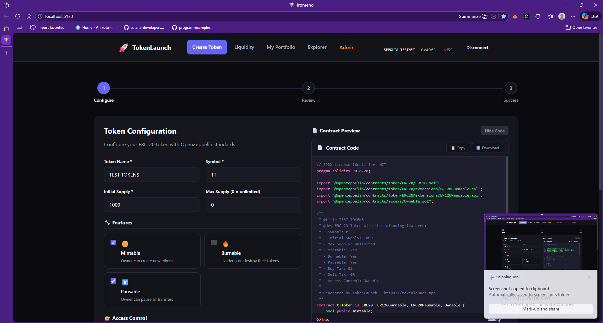

**Features shown:**
- Token name and symbol input
- Initial supply and max supply configuration
- Feature toggles: Mintable, Burnable, Pausable
- Access control selection
- Tax settings (buy/sell percentage)

---

### 2. Contract Preview

As you configure your token, the contract code is generated in real-time. The code editor features syntax highlighting, line numbers, and options to copy or download the source code.

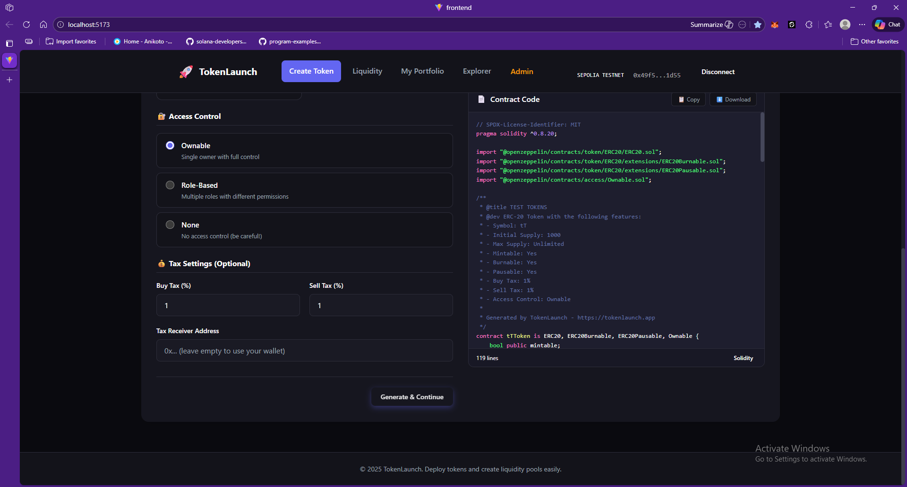

**Code Features:**
- Full Solidity source code preview
- OpenZeppelin imports
- NatSpec documentation
- Copy to clipboard
- Download as .sol file

---

### 3. Review & Deploy

Before deployment, review your token configuration. This step shows a summary of all selected options and the target network.

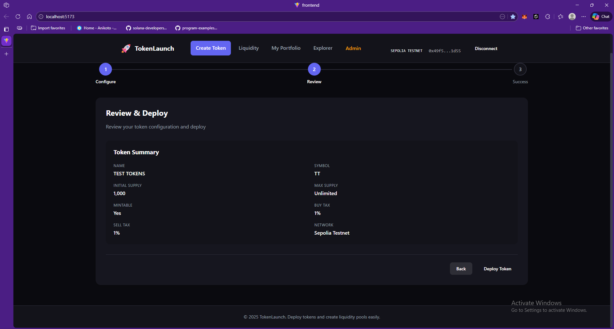

**Summary includes:**
- Token name and symbol
- Initial and max supply
- Enabled features (Mintable, Burnable, etc.)
- Tax percentages
- Target network (Sepolia Testnet)

---

### 4. Deployment Success

After successful deployment, you receive the contract address and transaction hash. Options to view on explorer or download source code are provided.

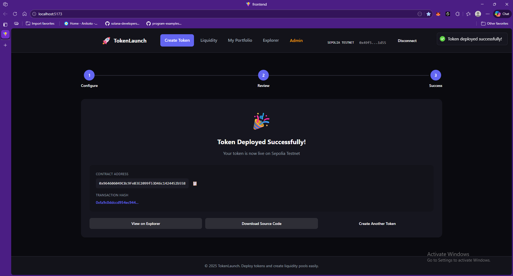

**Post-deployment options:**
- Copy contract address
- View on Etherscan
- Download verified source code
- Create another token

---

### 5. Add Liquidity

Create liquidity pools for your tokens on Uniswap V2. The interface automatically detects if a pair exists or needs to be created.

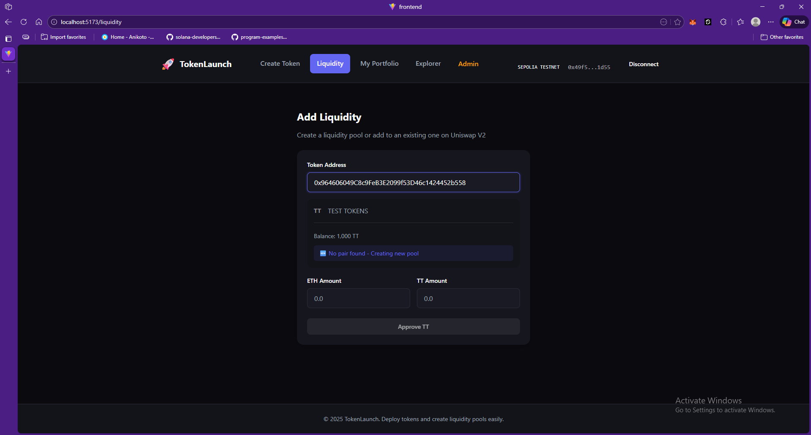

Enter the token address and specify the ETH and token amounts to add to the pool.


MetaMask confirmation for adding liquidity to the DEX.


Success screen showing transaction hash and pair address.

---

### 6. My Portfolio

View all your deployed tokens and liquidity positions in one place. Manage your tokens directly from the portfolio.

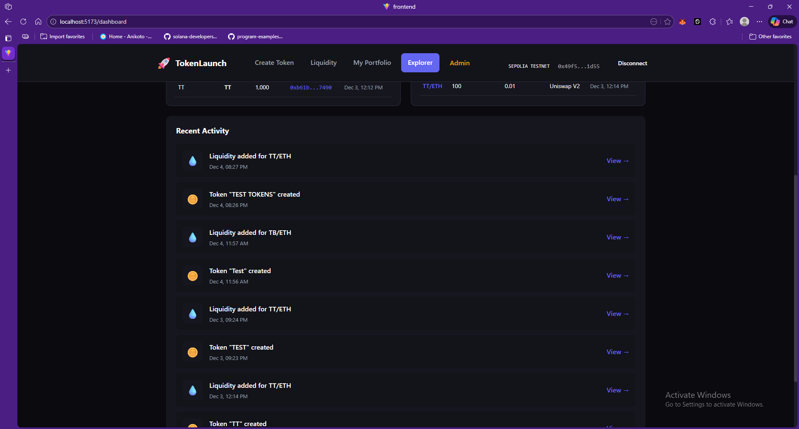

**Portfolio features:**
- Grid view of all deployed tokens
- Token details: supply, taxes, features
- Quick access to token management
- View on explorer links
- Badge indicators (Mintable, Burnable, Has Tax)

---

### 7. Admin Panel

Secure admin access with wallet signature authentication. Only whitelisted addresses can access the admin panel.

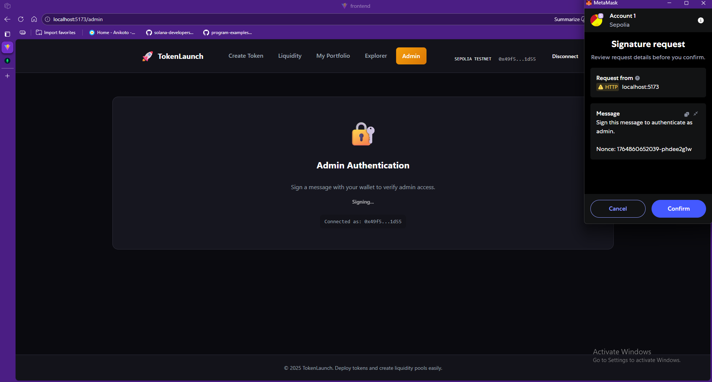

Sign a message with your wallet to verify admin access.


**Admin features:**
- Overview statistics (Total Tokens, Pools, Today's activity)
- Recent tokens list with timestamps
- Top creators leaderboard
- Tabs: Dashboard, Tokens, Pools, Analytics

---

### 8. Explorer Dashboard

Public dashboard showing all platform activity. Anyone can view recent tokens, pools, and activity.

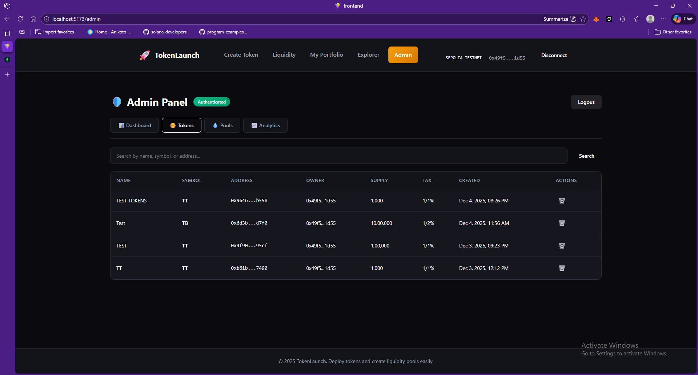

**Dashboard sections:**
- Stats cards (Tokens Created, Liquidity Pools, etc.)
- Recent Tokens table
- Recent Liquidity Pools table

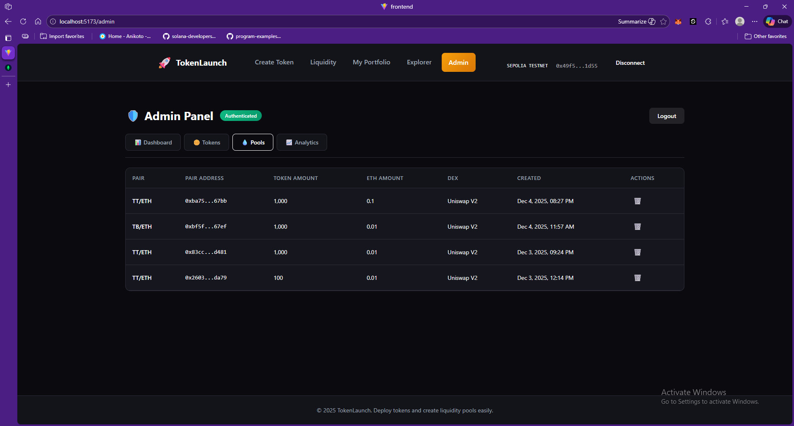

Activity feed showing token creations and liquidity additions with timestamps.

---

### 9. Uniswap Integration

Tokens created on TokenLaunch are fully compatible with Uniswap. Trade, add liquidity, and manage positions directly on Uniswap.

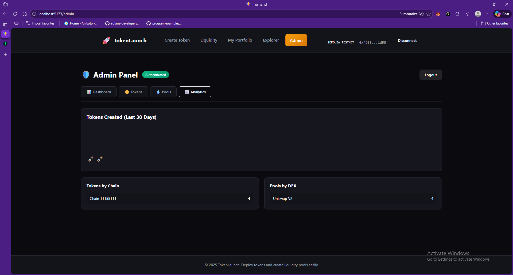

Search for your token by contract address on Uniswap.

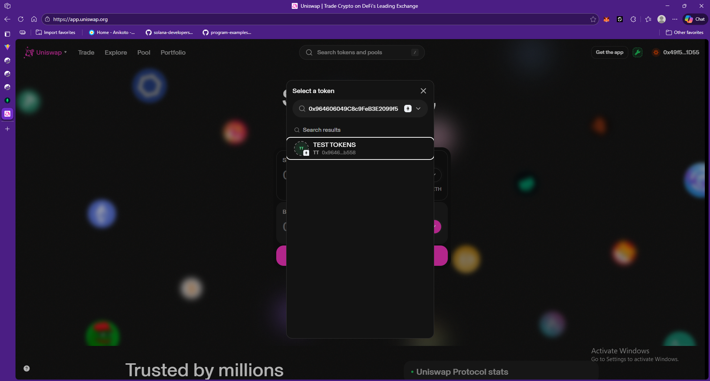

View your liquidity positions on Uniswap's Pool page.

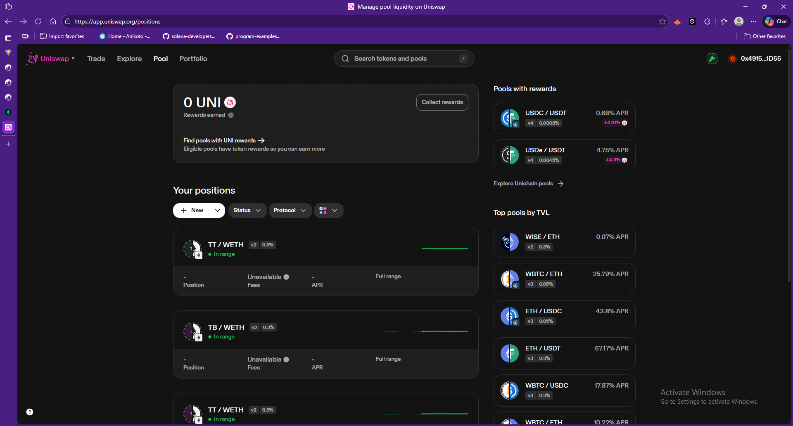

Detailed view of a TT/WETH liquidity position showing deposited amounts and pool share.

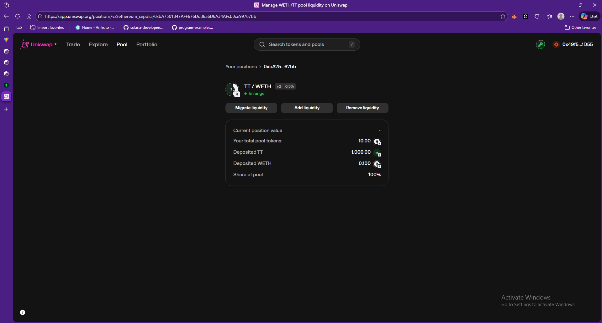

Portfolio overview on Uniswap showing tokens, balances, and recent transactions.

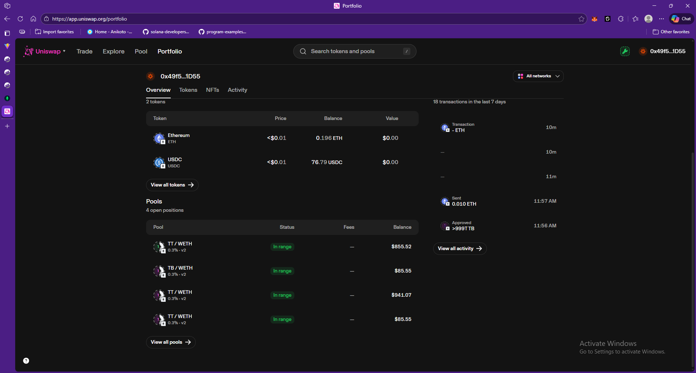

Complete portfolio overview on Uniswap showing all pools and their values.

---

## 🚀 Installation

### Prerequisites
- Node.js 18+
- MongoDB
- MetaMask wallet
- Sepolia ETH (from faucet)

### Clone Repository
```bash
git clone https://github.com/Tushar-ba/pump.fun.clone.git
cd pump.fun.clone
```

### Backend Setup
```bash
cd backend
npm install
cp .env.example .env
# Edit .env with your configuration
npm start
```

### Frontend Setup
```bash
cd Frontend
npm install
npm run dev
```

### Smart Contracts (Optional)
```bash
cd smartContract
npm install
npx hardhat compile
npx hardhat run scripts/deploy-all.js --network sepolia
```

---

## ⚙️ Configuration

### Backend Environment Variables (.env)
```env
PORT=3001
MONGODB_URI=mongodb://localhost:27017/tokenlaunch
NODE_ENV=development

# Frontend URL for CORS
FRONTEND_URL=http://localhost:5173

# Network configuration
DEFAULT_CHAIN_ID=11155111
SEPOLIA_RPC_URL=https://eth-sepolia.g.alchemy.com/v2/YOUR_API_KEY

# Deployed Contract Addresses (Sepolia)
LIQUIDITY_HELPER_ADDRESS=0xf7f3B3aEb0Ab69A123383F84D5d59a0C661C04be
MOCK_USDT_ADDRESS=0x2d5D8De86A18182152881cB283BD319E9b51414b

# DEX Configuration (Sepolia)
DEX_ROUTER_ADDRESS=0xeE567Fe1712Faf6149d80dA1E6934E354124CfE3
DEX_FACTORY_ADDRESS=0xF62c03E08ada871A0bEb309762E260a7a6a880E6

# Admin Configuration (comma-separated wallet addresses)
ADMIN_ADDRESSES=0xYourAdminWalletAddress
```

---

## 📜 Deployed Contracts

### Sepolia Testnet (Chain ID: 11155111)

| Contract | Address | Verified |
|----------|---------|----------|
| LiquidityHelper | `0xf7f3B3aEb0Ab69A123383F84D5d59a0C661C04be` | ✅ |
| MockUSDT | `0x2d5D8De86A18182152881cB283BD319E9b51414b` | ✅ |
| Sample Token | `0xE9085e06D0262c4Ea7A7002a1A3D55985fFe9C46` | ✅ |
| DEX Router | `0xeE567Fe1712Faf6149d80dA1E6934E354124CfE3` | - |
| DEX Factory | `0xF62c03E08ada871A0bEb309762E260a7a6a880E6` | - |

---

## 🔌 API Endpoints

### Public Endpoints
| Method | Endpoint | Description |
|--------|----------|-------------|
| GET | `/api/config/chains` | Get supported chains |
| GET | `/api/config/contracts/:chainId` | Get contracts for chain |
| POST | `/api/contracts/generate` | Generate & compile token |
| POST | `/api/contracts/track-deployment` | Track deployed token |
| GET | `/api/contracts/deployments` | Get all deployments |
| POST | `/api/liquidity/track` | Track liquidity pool |
| GET | `/api/liquidity/pools` | Get all pools |
| GET | `/api/stats/overview` | Get platform stats |
| GET | `/api/stats/recent-activity` | Get recent activity |

### Admin Endpoints (Protected)
| Method | Endpoint | Description |
|--------|----------|-------------|
| GET | `/api/admin/check` | Check if wallet is admin |
| GET | `/api/admin/nonce` | Get nonce for signing |
| POST | `/api/admin/verify` | Verify admin signature |
| GET | `/api/admin/dashboard` | Get admin dashboard data |
| GET | `/api/admin/tokens` | Get all tokens (admin) |
| GET | `/api/admin/pools` | Get all pools (admin) |
| DELETE | `/api/admin/tokens/:address` | Delete token |
| DELETE | `/api/admin/pools/:address` | Delete pool |

---

## 🔐 Security Considerations

- Tax cannot exceed 25%
- Only owner can mint (if enabled)
- Minting can be permanently disabled
- Owner and contract are excluded from tax by default
- Admin access requires wallet signature verification

---

## 🤝 Contributing

Contributions are welcome! Please feel free to submit a Pull Request.

1. Fork the repository
2. Create your feature branch (`git checkout -b feature/AmazingFeature`)
3. Commit your changes (`git commit -m 'Add some AmazingFeature'`)
4. Push to the branch (`git push origin feature/AmazingFeature`)
5. Open a Pull Request

---

## 📄 License

This project is licensed under the MIT License - see the [LICENSE](LICENSE) file for details.

---

## 🙏 Acknowledgments

- [OpenZeppelin](https://openzeppelin.com/) for secure smart contract libraries
- [Uniswap](https://uniswap.org/) for DEX protocol
- [Hardhat](https://hardhat.org/) for Ethereum development environment
- [Alchemy](https://alchemy.com/) for RPC endpoints

---

<p align="center">
  Made with ❤️ by <a href="https://github.com/Tushar-ba">Tushar</a>
</p>
